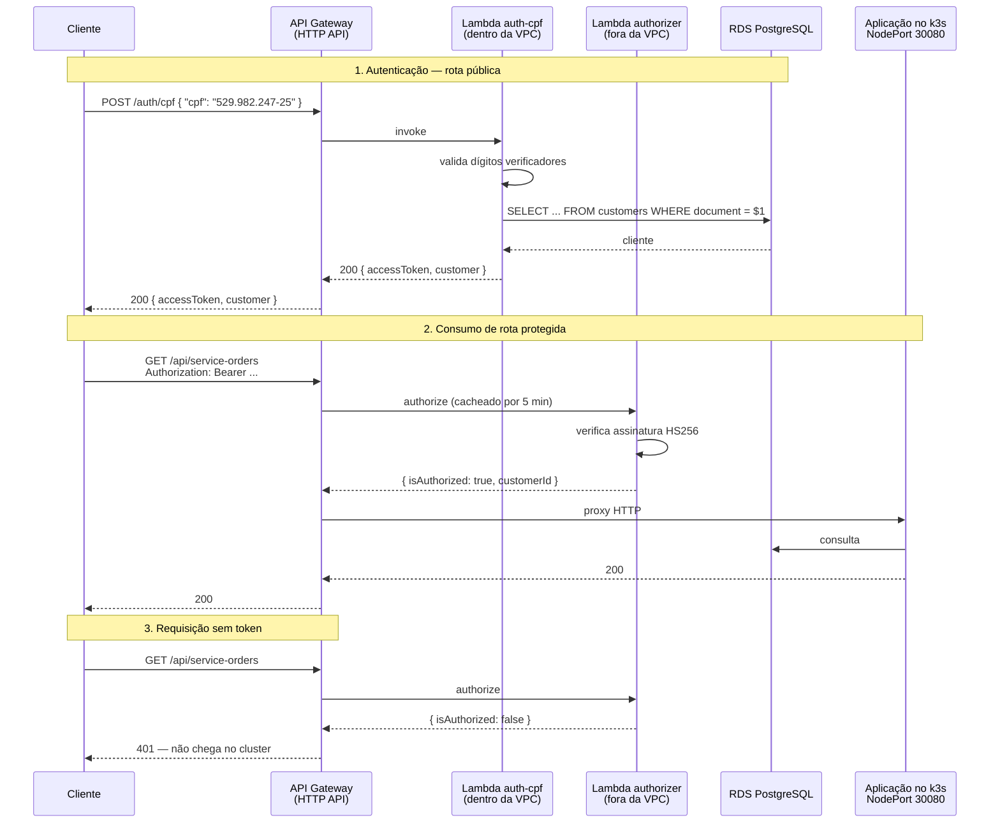

# oficina-lambda-auth

**Function serverless de autenticação por CPF** e **API Gateway** do sistema de gestão de oficina mecânica. É a porta de entrada pública de todo o sistema.

> Parte do Tech Challenge SOAT — Fase 3. Repositórios irmãos:
> [`oficina-infra-k8s`](https://github.com/Luizustavo/oficina-infra-k8s) ·
> [`oficina-infra-database`](https://github.com/Luizustavo/oficina-infra-database) ·
> [`oficina-backend`](https://github.com/Luizustavo/oficina-backend)

---

## Propósito

Um cliente da oficina não tem usuário e senha — ele tem CPF. Esta função recebe o CPF, valida os dígitos verificadores, confirma que o cliente existe na base e devolve um JWT que a API principal aceita nas rotas protegidas.

O API Gateway na frente faz duas coisas: expõe essa rota de autenticação e encaminha todo o resto para a aplicação rodando no k3s, barrando na borda qualquer requisição sensível sem token válido.

## Arquitetura deste repositório



### Rotas do gateway

| Rota | Destino | Protegida? |
|---|---|---|
| `POST /auth/cpf` | Lambda de autenticação | Não — é ela que emite o token |
| `ANY /api/health/{proxy+}` | Aplicação no k3s | Não — healthcheck e monitoração |
| `ANY /api/docs/{proxy+}` | Aplicação no k3s | Não — Swagger |
| `ANY /api/auth/{proxy+}` | Aplicação no k3s | Não — login de usuário interno |
| `ANY /{proxy+}` | Aplicação no k3s | **Sim** — Lambda authorizer |

No HTTP API a rota mais específica vence a mais genérica, então as públicas têm precedência sobre o `ANY /{proxy+}` protegido.

## Decisões que valem explicação

**Por que um Lambda Authorizer e não o JWT authorizer nativo do API Gateway.** O nativo só valida tokens assinados com chave assimétrica via JWKS/OIDC (RS256). Os tokens aqui são HS256, assinados com um segredo simétrico compartilhado com a aplicação — então a verificação precisa ser nossa.

**Por que `pg` puro e não Prisma.** O engine binário do Prisma estoura o limite prático de tamanho da Lambda e piora muito o cold start. Para duas queries simples, o driver puro resolve: os bundles saem com 142 KB e 57 KB.

**Por que o authorizer fica fora da VPC.** Ele só verifica assinatura, não toca no banco. Fora da VPC não precisa criar ENI, e o cold start cai — importante porque ele roda em toda requisição protegida.

**Por que os segredos são variáveis de ambiente e não SSM Parameter Store.** A função de autenticação roda dentro da VPC para alcançar o RDS, e a VPC não tem NAT Gateway (removido para cortar custo). Sem NAT, a Lambda não alcança o endpoint público do SSM, e um VPC Endpoint custaria mais que o resto da infraestrutura junta. As variáveis são criptografadas em repouso com KMS; o trade-off é que ficam visíveis para quem tem IAM de leitura na função.

**Por que a validação de CPF é duplicada.** O algoritmo é o mesmo de `oficina-backend/src/domain/validators/value-objects/cpf.value-object.ts`. Os repositórios são deployados de forma independente, e criar um pacote compartilhado para 30 linhas definidas pela Receita Federal custaria mais do que resolve.

**Por que 401 e não 404 quando o CPF não existe.** Responder "não encontrado" transformaria o endpoint num oráculo para descobrir quais CPFs estão cadastrados na oficina.

## Tecnologias

| Camada | Tecnologia |
|---|---|
| Runtime | Node.js 20 (AWS Lambda) |
| Linguagem | TypeScript 5 (strict) |
| Bundler | esbuild |
| Banco | `pg` (driver puro) |
| Token | `jsonwebtoken`, HS256 |
| Gateway | AWS API Gateway HTTP API (apigatewayv2) |
| IaC | Terraform >= 1.11, state remoto no S3 |
| Testes | Jest (cobertura ≥ 80%) |
| CI/CD | GitHub Actions |

---

## ⚠️ Depende dos outros dois repositórios de infraestrutura

Este é o **terceiro** da cadeia. Ele lê, via `terraform_remote_state`:

- de `oficina-infra-k8s` — VPC, subnets privadas e o IP do nó (destino do proxy);
- de `oficina-infra-database` — a connection string e o security group do RDS.

```
Ordem de apply:    oficina-infra-k8s  →  oficina-infra-database  →  oficina-lambda-auth
Ordem de destroy:  oficina-lambda-auth  →  oficina-infra-database  →  oficina-infra-k8s
```

Este repositório cria uma regra de ingress **no security group do RDS**, que pertence ao repositório do banco. Por isso ele tem de ser o primeiro a ser destruído. A pipeline confere as duas dependências e falha com mensagem clara se faltar alguma.

## Execução local

```bash
npm install
npm test              # 40 testes
npm run test:coverage
npm run typecheck
npm run build         # gera dist/handler.js e dist/authorizer.js
```

## Deploy

```bash
npm run build                      # o Terraform empacota dist/, então build vem antes
cd infra
cp terraform.tfvars.example terraform.tfvars
terraform init
terraform plan
terraform apply
```

### Depois do apply — sincronizar o JWT secret

O Terraform gera o segredo HS256 compartilhado. **O mesmo valor precisa estar no Secret do Kubernetes da aplicação**, senão a API rejeita os tokens emitidos aqui:

```bash
terraform output -raw jwt_secret
```

Coloque o valor em `JWT_SECRET` no `k8s/secret.yaml` de `oficina-backend` e reaplique o Secret e o Deployment.

Para reaproveitar um `JWT_SECRET` que já existe em vez de gerar outro, preencha `jwt_secret` no `terraform.tfvars`.

## Como testar

```bash
API=$(terraform -chdir=infra output -raw api_gateway_url)

# 1. Autenticar com CPF
curl -X POST "$API/auth/cpf" \
  -H 'content-type: application/json' \
  -d '{"cpf":"529.982.247-25"}'

# 2. Usar o token numa rota protegida
TOKEN="<accessToken devolvido acima>"
curl "$API/api/service-orders" -H "Authorization: Bearer $TOKEN"

# 3. Sem token — barrado na borda, nem chega no cluster
curl -i "$API/api/service-orders"    # 401
```

### Respostas da rota de autenticação

| Situação | Status | Corpo |
|---|---|---|
| Cliente encontrado | 200 | `{ accessToken, expiresIn, customer }` |
| CPF com dígito verificador errado | 400 | `{ message: "CPF inválido" }` |
| Campo `cpf` ausente ou não-string | 400 | `{ message: "Campo \"cpf\" é obrigatório" }` |
| Cliente não cadastrado | 401 | `{ message: "Cliente não encontrado ou inativo" }` |
| Banco indisponível | 503 | `{ message: "Serviço temporariamente indisponível" }` |

---

## CI/CD

`.github/workflows/ci-cd.yml`:

| Gatilho | O que roda |
|---|---|
| Pull Request para `main` | testes + typecheck → build → `plan`, comentado no PR |
| Push em `main` | testes → build → `apply` automático |
| `workflow_dispatch` | `plan`, `apply` ou `destroy` sob demanda |

O job de deploy roda no Environment `production`. Ele existe mas **está sem required reviewers**, então o apply é de fato automático no merge — que é o "deploy automático da branch de produção" exigido pela Fase 3. Para exigir aprovação humana, adicione reviewers em *Settings → Environments → production*.

**Secrets necessários** em *Settings → Secrets and variables → Actions*: `AWS_ACCESS_KEY_ID` e `AWS_SECRET_ACCESS_KEY`.

**Proteção da branch `main`**: PR obrigatório, 1 aprovação, sem push direto.

## Observabilidade

Ambas as funções emitem log estruturado em JSON com `requestId`, e o stage do API Gateway registra em JSON método, rota, status, latência e erro de integração. Retenção de 7 dias por padrão (`log_retention_days`) — log é o principal custo aqui.

```bash
aws logs tail "/aws/lambda/$(terraform -chdir=infra output -raw auth_lambda_name)" --follow
aws logs tail "/aws/apigateway/oficina-backend" --follow
```

Nenhum log registra o CPF recebido: é dado pessoal.

## Custo aproximado

| Recurso | Custo |
|---|---|
| Lambda | 1 M de requisições/mês grátis, sempre |
| API Gateway HTTP API | US$ 1,00 por milhão de requisições |
| CloudWatch Logs | 5 GB/mês grátis |

Na prática, para o volume de uma demonstração, fica em zero.

## API

Documentação Swagger da aplicação: `{api_gateway_url}/api/docs` — ou [`docs/openapi.json`](https://github.com/Luizustavo/oficina-backend/blob/main/docs/openapi.json) no repositório da aplicação, importável no Postman/Insomnia.
